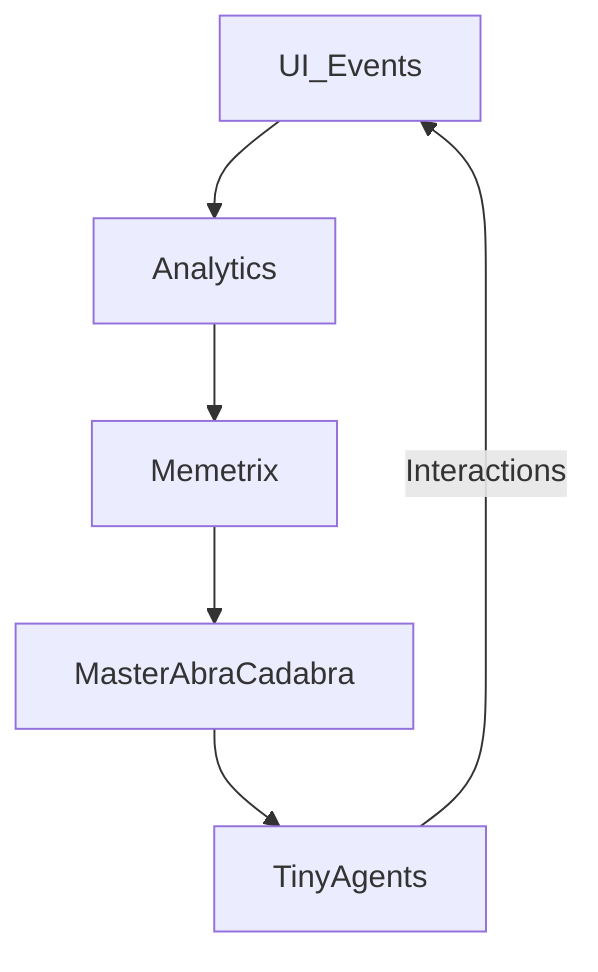

# Memetrix & AbraCadabra Architecture

## Overview

Memetrix & AbraCadabra form a two‑tiered AI‑driven platform combining a public application layer with a hidden, private backbone. The system integrates blockchain, custom crypto‑coin economics, AI “tiny agents,” and a core microkernel OS to deliver secure, encrypted communication, on‑chain training, and extensible user workflows.

This README is intended to give a high‑level summary for software engineers and architects evaluating the project.

---

## Detailed AbraCadabra Agent & Training System

Below is a walkthrough of AbraCadabra’s core tools in their operational order. Each section includes a brief introduction, the corresponding UI screenshot, and a concise description.

---

### 1. Chain Scraper Tool

**Purpose:** Listen to on‑chain events, hash outputs, and batch them for downstream training.

*UI Overview:* Displays incoming block events, hash status, and batching progress. Operators can adjust filters and view logs in real time.

### 2. Payments & Rewards Console

**Purpose:** Visualize agent contributions and manage token‑based rewards.

*UI Overview:* Shows token allocations per agent, total rewards distributed, and historical contribution charts. Enables manual adjustments and policy tests.

### 3. Multi‑Chat Operator Dashboard

**Purpose:** Supervise, test, and troubleshoot multiple agent conversations concurrently.

*UI Overview:* Tabs for each active agent thread, live message streams, and quick‑inject prompt panel for testing new inputs.

### 4. Sub‑Editor & Targeter

**Purpose:** Manually review, correct, and reissue specific agent tasks before on‑chain commitment.

*UI Overview:* Side‑by‑side editor for raw agent output and target parameters, with buttons for rerun, approve, or reject.

### 5. UI Overview & CRUD Flow

**Purpose:** Central command dashboard illustrating the full create/update/delete lifecycle and system status.

*UI Overview:* High‑level controls for spawning agents, viewing system health, and initiating CRUD operations.

*Flow Description:* Each CRUD action is hashed into a token, registered on-chain, and ultimately consumed (burned) to ensure auditability.

---

## Presentation Outline

1. **Overview & Vision**
2. **Two-Tier Architecture**
3. **Core Components & Roles**
   - Public App Layer
   - Private/Hidden Layer
   - AbraCadabra OS
   - User Roles & Permissions
4. **Blockchain & Crypto-Economics**
5. **AI Agents & Swarm**
6. **Training Gym & Continuous Learning**
7. **Feature Build & Validation System**
8. **Hash & Vector File System**
9. **OS Manifest & Transfer**
10. **Trolls App Demo**
11. **UI Screenshots**
12. **Video Walkthroughs**
13. **Deployment & Infrastructure**
14. **Future Roadmap**

---

## AbraCadabra Agent & Training System

### Agent Lifecycle

- **Spawn (Minting)**
  - Master AbraCadabra issues an on-chain call, minting a unique hash token.
  - Token defines the scope, permissions, and data inputs for the upcoming agent run.
- **Instantiation**
  - AbraCadabra OS loads only the microservices required (e.g., content-tagger, wallet-watcher) into a secure sandbox.
- **Execution**
  - Agents perform tasks (e.g., event scraping, data labeling) within isolated environments.
- **Reporting**
  - Results and metrics stream back to Master AbraCadabra; analytics pipelines ingest performance data.
- **Termination (Burning)**
  - The on-chain hash token is irreversibly consumed; sandbox resets to a clean state.

#### Chain Scraper Tool

*A high-throughput agent that scrapes blockchain events, hashes the outputs, and sends batched payloads for training.*

---

### Training Gym & Policy Management

- **Simulation Environment**
  - Synthetic on-chain scenarios and user-interaction mocks.
- **Reinforcement Loop**
  - Memetrix pipelines compute gradients from agent rewards and deploy updated policy weights.
- **Validation & Deployment**
  - Smart contracts gate proven policies before auto-propagating to live agents.

#### Payments & Rewards Console

*Visualizes token allocations, tracks agent contribution scores, and manages reward distributions.*

---

### Monitoring & Feedback

#### Multi-Chat Operator Dashboard

*Oversee multiple agent conversations, inject test prompts, and review live logs.*

---

### Security & Governance

- **On-Chain Authorization**: Agent operations require signed transactions by token-holders.
- **Role-Based ACLs**: Distinct permissions for customers, moderators, and dev-ops.
- **Immutable Audit Trail**: Complete record of hash tokens and agent runs on Solana.

#### Sub-Editor & Targeter

*Allows manual content review, corrections, and targeted task reissuance.*

---

### Infrastructure & Scaling

- **Master Service**: Stateless Node.js/Go gateway.
- **AbraCadabra OS Agents**: Lightweight (≤100 MB) containers provisioned dynamically.
- **Compute Fabric**: Kubernetes-managed GPU nodes and spot instances for training.

#### UI Overview & CRUD Flow

*The central dashboard for agent control and the CRUD data lifecycle, from creation to on-chain burn.*

---

## Two‑Tier System

The platform is split into two main tiers:

1. **Public Tier**: Customer‑facing apps providing core features and UX.
2. **Private Tier**: Hidden infrastructure and internal apps (Employee Apps, Moderator Tools) that manage on‑chain interactions, analytics, and system governance.

---

## Core Components

### Public App Layer

- **Customer App**: Web or mobile UI exposing services to end users, payment, and basic AI chat.
- **Public Version Server**: Hosts the public API, static assets, and orchestrates calls to the blockchain or AI swarm.

### Private/Hidden Layer

- **Employee Apps**: Internal dashboards for support, monitoring, and content moderation.
- **Moderator Tools**: Role-based interfaces for overseeing community content and token‑holder governance.
- **Private Version Server**: Manages internal workflows and secure CRUD operations.

### AbraCadabra OS

- A lightweight microkernel managing local AI agents, temporary hash lifecycle, and secure data sandboxing.
- Installed on devices (e.g., user desktop, secure enclave) to coordinate encrypted workflows.

### Master AbraCadabra & Memetrix

- **Master AbraCadabra**: Core coordination service that bridges front‑end, AbraCadabra OS instances, and blockchain.
- **Memetrix**: AI orchestration layer providing analytics, training data pipelines, and RL policy updates.

---

## Blockchain & Crypto Economics

### Memetrix Coin

- Custom SPL token used to incentivize training contributions, governance, and network fees.
- On‑chain transactions track contribution credits for tiny agents and human operators.

### Solana Integration

- High‑throughput, low‑fee chain for minting, burning, and transferring Memetrix Coins.
- Immutable smart contracts enforce logic for token flows and CRUD call validation.

---

## AI Agents & Swarm

### Tiny Agents

- Containerized AI instances performing micro‑tasks (e.g., content tagging, wallet creation, on‑chain event monitoring).
- Each agent is born, completes a task, and the temporary hash is burned.

### AI Swarm & Cloud GPUs

- Master AbraCadabra coordinates a distributed swarm of agents for large‑scale data processing.
- Heavy training jobs offloaded to cloud GPU clusters for RL/ML model updates.

---

## Training Gym & ML/RL

- Closed‑loop environment where Memetrix orchestrates training runs (gym), collects metrics via analytics, and deploys updated policies.
- Enables continuous improvement of tiny agent behaviors and core inference models.

---

## Data Flow & Security

### CRUD Hashing & Temporary Tokens

- Every CRUD call in an 18‑month window is hashed into a temporary token.
- This hash is submitted to the server and registered on‑chain to ensure auditability.
- Once consumed, the temporary hash is irreversibly burned.

### Immutable Smart Contracts

- Smart contracts validate token flows, enforce business logic, and provide an audit trail for all interactions.

### Encryption & Message Decryption

- Messages routed through immutable contracts are decrypted on the receiving AbraCadabra OS instance.
- Ensures end‑to‑end encryption across devices and the public network.

---

## Client-Side AI & Local Swarm Flowcharts

Below are the key flowcharts illustrating local AI agent orchestration, blockchain integration, and OS lifecycle on the client side.

### Two-Tier Local Flow (As Above, So Below)

*Depicts the public app layer feeding into the hidden local backbone, mirroring operations “as above, so below.”*

### Blockchain Transaction & Token Flow

*Shows on-chain token minting, transfer, and burn cycles managed by the local swarm.*

### Agent Hash Lifecycle (Born → Live → Die)

*Visualizes the creation of a temporary hash token, agent execution, and irreversible burn at task completion.*

### Monitoring & Continuous Feedback

*Mermaid flowchart of local agent interactions, analytics, and policy updates within the client OS.*

---

## User Roles & Permissions

- **Customer**: Interacts with the public UI, holds tokens, and can participate in governance.
- **Employee**: Access to internal apps, analytics dashboards, and support tools.
- **Moderator**: Elevated permissions for content and community oversight.
- **Token Holder**: On‑chain governance rights, staking, and training rewards.

---

## Deployment & Infrastructure

- **Front‑End**: React or native mobile apps hosted via CDN.
- **Back‑End Servers**: Node.js/Go microservices for public and private tiers.
- **AbraCadabra OS**: Lightweight installer for Windows/macOS/Linux.
- **Blockchain Node**: Solana RPC endpoints with dedicated validators.
- **AI Cluster**: Kubernetes‑orchestrated GPU nodes for training and inference.

---

## Feature Build System

The **Feature Build System** orchestrates how employee-level operators and CI pipelines assemble applications from tiny, hashed feature chunks:

1. **Chunk Definition**

   - Developers define discrete app features (UI widget, API handler, microservice) as standalone modules.
   - Each module is packaged and hashed, producing a unique feature ID.

2. **On-Chain Registration**

   - The feature hash and metadata (dependencies, version, permissions) are published to an immutable smart contract on Solana.
   - Smart contract enforces access controls and tracks feature provenance.

3. **Employee Retrieval**

   - Employee-level tools query the smart contract for approved feature IDs.
   - Approved hashes are fetched from distributed storage and verified against on-chain records.

4. **Assembly & Validation**

   - Retrieved feature modules are loaded into the AbraCadabra OS build sandbox.
   - A build orchestrator dynamically links modules, resolves dependencies, and runs automated tests.
   - Build logs and resulting artifact hashes are written back to the contract.

5. **Deployment**

   - Successfully assembled artifacts are deployed to staging or production environments.
   - The final application hash is registered on-chain to ensure end-to-end auditability.

This workflow ensures strong version control, modularity, and trust through cryptographic validation.

---

## File-Structure Hash & Vectorization

This diagram illustrates transforming a traditional file/folder tree into hashed JSON references, which are then consumed by AI agents for OS assembly and vector-based operations.

---

## Software Reconstruction Workflow

Below is the end-to-end flow of hashing and reconstructing application features using tiny AI agents, a local vector database, and a global Solana smart contract:

1. **Local Feature Extraction & Hashing**

   - Developers or employee tools scan the target codebase and break it into minimal feature chunks (functions, UI widgets, configs).
   - Each chunk is serialized into JSON and hashed locally (e.g., SHA-256), producing a unique feature identifier.

2. **Local Vectorization & Storage**

   - Hashed JSON chunks are embedded into vector representations via a local vector database.
   - Enables semantic search, similarity queries, and dependency resolution at build time.

3. **On-Chain Registration & Holding**

   - The feature hash, metadata (version, author, dependencies), and commit pointer are published to a global Solana smart contract.
   - Smart contract holds the feature IDs in escrow until all prerequisites (e.g., policy approvals) are met.

4. **Triggering Reconstruction**

   - Employee tools or CI pipelines signal the smart contract when a release window opens.
   - Smart contract emits an on-chain event listing approved feature IDs for reconstruction.

5. **Agent-Driven Retrieval & Validation**

   - Tiny AI agents subscribe to on-chain events and fetch feature hashes from the contract.
   - Agents pull the corresponding JSON blobs from distributed storage and verify integrity against on-chain hashes.

6. **Vector Matching & Dependency Resolution**

   - Agents query the local vector DB to match related chunks, resolve transitive dependencies, and infer linking order.

7. **Dynamic Assembly in Sandbox**

   - Validated chunks are loaded into the AbraCadabra OS sandbox by the build orchestrator.
   - The orchestrator compiles, links, and runs automated tests to ensure correctness.

8. **Final Hashing & Deployment**

   - The assembled artifact is hashed to produce a release ID.
   - Release ID is recorded back on-chain; agents trigger deployment to staging or production.

*This workflow combines cryptographic guarantees with AI-driven reconstruction, ensuring modular, auditable, and intelligent builds.*

---

## Instant App Manifestation & Dynamic UI Generation

By leveraging Solana smart contracts, local vector DBs, and tiny AI agents, AbraCadabra can assemble and render complete applications on-demand:

1. **Feature Storage in Smart Contracts**

   - Each hashed feature chunk (UI component, service module) is held in escrow by a global Solana smart contract.
   - The contract includes metadata for animation parameters, style rules, and interactivity specs.

2. **Manifest Triggering**

   - A user or CI pipeline submits a “manifest request” transaction, specifying desired features and layout preferences.
   - The smart contract validates permissions and emits events listing approved chunk hashes and animation metadata.

3. **Agent-Driven Rendering**

   - Dedicated AI rendering agents subscribe to contract events, fetch vectorized feature embeddings, and interpret animation specs.
   - Agents generate animated UI elements (buttons, menus, widgets) on-the-fly, styling them per user theme settings.

4. **Assembly & Live Preview**

   - The AbraCadabra OS sandbox stitches together rendered components, resolves layout, and launches a live preview on the user’s device.
   - Users can interact immediately with fully functional, animated UI—no manual coding required.

5. **Persistence & Portability**

   - The final manifest (component hashes + layout config) is recorded back on-chain for reproducibility.
   - Users can export or migrate their app state; a new device can re-run the manifest to regenerate the exact interface and behavior.

*This enables instant prototyping and deployment of custom applications, with AI-driven animated tools and UI generated seamlessly from on-chain feature definitions.*

---

\$1

---

## Employee & Public Instant Reconstruction

AbraCadabra enables both employee-level operators and end users to dynamically assemble and deploy applications in real time:

1. **Employee Tool Construction**

   - Internal teams define feature modules and register hashes via the Feature Build System.
   - Approved chunks reside in the Solana smart contract until needed.

2. **Public Manifestation**

   - End users trigger a manifest request (e.g., via a mobile or web UI), specifying the desired app configuration.
   - The smart contract validates permissions and emits reconstruction instructions.

3. **On-the-Fly Reconstruction**

   - Tiny AI agents on the user’s device fetch, validate, and vector-match feature chunks.
   - The AbraCadabra OS sandbox stitches modules into a cohesive application, including animated buttons and custom tools.

4. **Seamless Transition**

   - Applications morph instantly—your phone or desktop UI transforms into the optimal toolset for the current task.
   - When the session ends, the sandbox resets, preserving only the minimal default user state for the next reconstruction.

*This real-time, bidirectional workflow ensures that both builders and users experience instantaneous, context-aware application assembly driven by AI agents and on-chain orchestration.*

---

## Trolls App Experience

An experimental social application powered by tiny AI submodules (“trolls”), featuring rapid meme generation, micro-interactions, and optional moderation to foster playful chaos.

---

---

---

## UI Screenshots

### Payments & Rewards

### Scrape Chain

### Sub-Editor & Targeter

### Project Roadmap

### UI Overview

### Multi-Chat Operator

### Job Automation Risk Table

### Project-Level Node Chain

### CRUD Flow

---

---

## Video Demos

### Punch In / Punch Out Workflow

### Data Flow Overview

### Node Flow & Targeting

### Gamer Keyboard Interaction

### User Preferences Panel

### Data Creation Wizard

### Table Editor

### Scrape Chain Workflow

### Chain of Thought Editor

### Chain of Thought Dissection

---

## Future Roadmap

- **Zero‑Trust Architecture**: Multi‑party computation for private data flows.
- **Expanded Agent Library**: Domain‑specific AI micro‑services (e.g., legal, financial, creative).
- **Cross‑Chain Support**: Integrate Ethereum L2s, BSC, etc.
- **UI/UX Polish**: New design systems for seamless user experiences.
- **Marketplace Module**: On‑chain app store for third‑party plugins.

---

*For detailed technical specs, API references, and developer guides, please refer to the ****\`\`**** directory within this repository.*

